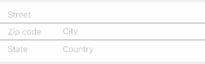

# PostalAddressRow

<p align="left">
<a href="https://travis-ci.org/EurekaCommunity/PostalAddressRow"></a>

<a href="https://developer.apple.com/swift"></a>
<a href="https://github.com/Carthage/Carthage"></a>
<a href="https://cocoapods.org/pods/XLActionController"></a>
<a href="https://raw.githubusercontent.com/EurekaCommunity/PostalAddressRow/master/LICENSE"></a>
</p>

By [Xmartlabs SRL](http://EurekaCommunity.com).

## Contents
 * [Introduction](#introduction)
 * [Usage](#usage)
 * [Requirements](#requirements)
 * [Getting involved](#getting-involved)
 * [Examples](#examples)
 * [Installation](#installation)
 * [Customization](#customization)
 * [Roadmap](#roadmap)
 
## Introduction

PostalAddressRow is an Eureka row that shows a series of UITextField's for the user to enter postal address information.



## Usage

```swift
import Eureka
import PostalAddressRow

class ViewController: FormViewController {

    override func viewDidLoad() {
        super.viewDidLoad()
        form +++ Section()
            <<< PostalAddressRow() {
                $0.streetPlaceholder = "Street"
                $0.statePlaceholder = "State"
                $0.cityPlaceholder = "City"
                $0.countryPlaceholder = "Country"
                $0.postalCodePlaceholder = "Zip code"
        }
    }
}
```

## Requirements

* iOS 9.0+
* Xcode 8.3+
* Eureka version 2.*

## Getting involved

* If you **want to contribute** please feel free to **submit pull requests**.
* If you **have a feature request** please **open an issue**.
* If you **found a bug** or **need help** please **check older issues and threads on [StackOverflow](http://stackoverflow.com/questions/tagged/PostalAddressRow) (Tag 'PostalAddressRow') before submitting an issue.**.

Before contribute check the [CONTRIBUTING](https://github.com/EurekaCommunity/PostalAddressRow/blob/master/CONTRIBUTING.md) file for more info.

If you use **PostalAddressRow** in your app We would love to hear about it! Drop us a line on [twitter](https://twitter.com/EurekaCommunity).

## Examples

Follow these 3 steps to run Example project: Clone PostalAddressRow repository, open PostalAddressRow workspace and run the *Example* project.

## Installation

#### CocoaPods

[CocoaPods](https://cocoapods.org/) is a dependency manager for Cocoa projects.

To install PostalAddressRow, simply add the following line to your Podfile:

```ruby
pod 'PostalAddressRow', '~> 1.0'
```

#### Carthage

[Carthage](https://github.com/Carthage/Carthage) is a simple, decentralized dependency manager for Cocoa.

To install PostalAddressRow, simply add the following line to your Cartfile:

```ogdl
github "EurekaCommunity/PostalAddressRow" ~> 1.0
```

You will then have to add `PostalAddressRow` and `Eureka` frameworks (from the `Carthage/Builds/iOS` folder) to your project's target embedded binaries.

## Customization

`PostalAddressCell` has five text fields that can be used and customised:

```swift
	var streetTextField: UITextField?
    var postalCodeTextField: UITextField?
    var cityTextField: UITextField?
    var stateTextField: UITextField?
    var countryTextField: UITextField?
```

There are also two separator views which are displayed between the text fields by default:

```swift
var firstSeparatorView: UIView?
var secondSeparatorView: UIView?
```

Another variable is `textFieldOrdering` which holds all the used text fields and should make clear the order in which they are displayed so that the navigation between these rows works properly:

```swift
var textFieldOrdering: [UITextField?] = []
```

On the `PostalAddressRow` you can specify the placeholder and a formatter for each text field. You can also specify if these formatters should be used while the user is entering text.

Another variable is `postalAddressPercentage` which defines how much space the text fields on the left become compared to those on the right (ZIP code and state are on the left and city and country are on the right in the default cell). This constant is used in a constraint of proportional width between the corresponding text fields.

You can also specify the `keyboardReturnType` which handles the keyboard return key depending whether there is a row after the current or not.

## How to change the design of the cell
You can implement your own design white easily. For this just create a nib file with your cell and customise it as you want. Make sure that the cell is a subclass of `_PostalAddressCell` (it can't be generic). Then connect the outlets of the UITextField's and separator views you used and you are ready.
The example project shows you how you can do all of this.

> Note: It can be tricky to connect the outlets sometimes. If Xcode does not let you connect them to `_PostalAddressCell` then you should either add them manually, editing the .xib file or copy the outlets declarations to your subclass, connect them to the text fields in the xib file and them remove them from your subclass :-)

After creating your nib file you have to create a row that uses it, like this:

```swift
final class MyPostalAddressRow: _PostalAddressRow<PostalAddressCell>, RowType {
    public required init(tag: String? = nil) {
        super.init(tag: tag)
        cellProvider = CellProvider<PostalAddressCell>(nibName: "CustomNib", bundle: Bundle.main)
    }
}
```

## Roadmap

What still remains to be done:

* Add a country picker?

## Author

* [Xmartlabs SRL](https://github.com/EurekaCommunity) ([@EurekaCommunity](https://twitter.com/EurekaCommunity))

# Change Log

This can be found in the [CHANGELOG.md](CHANGELOG.md) file.
